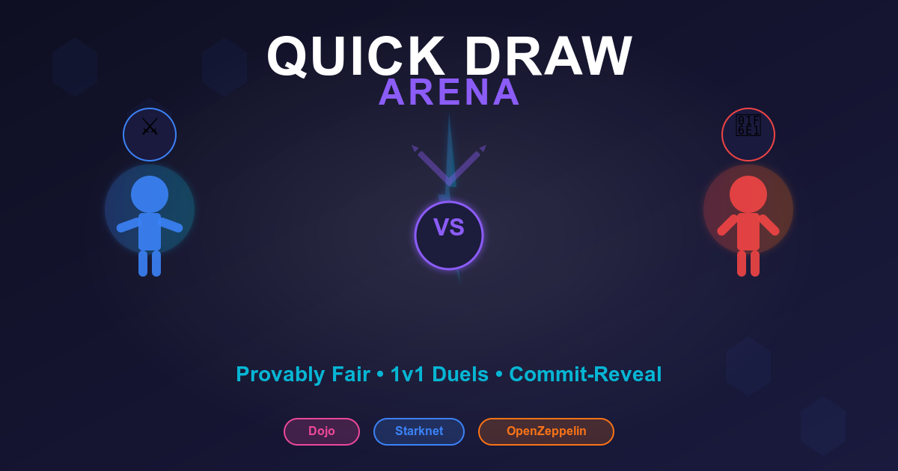

---

# Quick Draw Arena - Deployment Guide

## Project Overview

Quick Draw Arena is a 1v1 commit-reveal dueling game built on Dojo (Starknet) with rock-paper-scissors style combat.

## Smart Contract Features

### Models
- **Match**: Tracks game state, players, wager, rounds won, current round, status
- **RoundCommitment**: Implements commit-reveal pattern for secure action submission
- **PlayerStats**: Tracks wins, losses, total wagered, total won

### Game Systems
- `create_match(wager)` - Create new match with wager amount
- `join_match(match_id)` - Join an existing waiting match
- `commit_action(match_id, commitment)` - Commit hashed action (Poseidon hash)
- `reveal_action(match_id, action, salt)` - Reveal action and resolve round

### Game Rules
- Best of 3 rounds
- Actions: Attack (1), Defend (2), Special (3)
- Rock-paper-scissors logic:
  - Attack beats Defend
  - Defend beats Special
  - Special beats Attack
- First to win 2 rounds wins the match
- Winner receives 2x wager amount

## Local Deployment (✅ Completed)

### Prerequisites
- Dojo 1.5.1 (sozo, katana, torii)
- WSL or Linux environment

### Steps

1. **Build contracts**:
   ```bash
   cd /mnt/c/Users/LENOVO/Documents/resolve-stark/quick_draw_arena
   sozo build
   ```

2. **Start Katana (local testnet)**:
   ```bash
   katana --dev --dev.no-fee
   ```

3. **Deploy**:
   ```bash
   sozo migrate
   ```

### Deployed Addresses (Local Katana)

- **World Address**: `0x0334b5b21b21e43bc45661f1bb915cfa96676e731aac509200d9d789a80d94a4`
- **RPC URL**: `http://localhost:5050/`
- **Default Account**: `0x127fd5f1fe78a71f8bcd1fec63e3fe2f0486b6ecd5c86a0466c3a21fa5cfcec`

## Sepolia Deployment (Completed)

### Current Status
Deployed MVP UI

### Configuration Files

- `dojo_dev.toml` - Local Katana configuration
- `dojo_sepolia.toml` - Sepolia testnet configuration (created)
- `Scarb.toml` - Build configuration with Sepolia profile

### Deploy to Sepolia 
```bash
# Build for Sepolia
sozo -P sepolia build

# Deploy to Sepolia
sozo -P sepolia migrate
```

## Project Structure

```
quick_draw_arena/
├── src/
│   ├── lib.cairo              # Module exports
│   ├── models.cairo           # Game models (Match, RoundCommitment, PlayerStats)
│   └── systems/
│       └── actions.cairo      # Game logic systems
├── Scarb.toml                 # Build configuration
├── dojo_dev.toml             # Local deployment config
├── dojo_sepolia.toml         # Sepolia deployment config
└── DEPLOYMENT.md             # This file
```

## Testing Locally

You can test the game using sozo commands:

```bash
# Create a match (replace with actual wager amount)
sozo execute quick_draw_arena-actions create_match -c 1000

# Join a match (replace match_id)
sozo execute quick_draw_arena-actions join_match -c 1

# Commit action (compute hash off-chain first)
# Hash = poseidon(action, salt)
sozo execute quick_draw_arena-actions commit_action -c 1,<commitment_hash>

# Reveal action
sozo execute quick_draw_arena-actions reveal_action -c 1,<action>,<salt>
```

## Next Steps

1. ✅ Smart contracts deployed locally
2. ✅ Frontend development (React + Vite + Dojo SDK)
4. ✅ Deploy to Sepolia and verify on Starkscan
5. ✅ Integrate Cartridge Controller for wallet management
6. ⏳ OpenZeppelin integration for token economy

## Links

- **Dojo Documentation**: https://book.dojoengine.org/
- **Starknet Sepolia Faucet**: https://faucet.starknet.io/
- **Starkscan (Sepolia)**: https://sepolia.starkscan.co/

## Notes
### Technical Deep Dive:
Integrate OpenZeppelin at multiple levels:

- ERC20 DUEL Token - Used the full ERC20Component with Ownable for admin minting. Players approve the game contract once, then it handles escrow during matches. Winner gets 2x automatically on match completion.
- ERC721 Achievements - Only the game contract can mint these NFTs, enforced through access control. Each achievement type is stored in the token's metadata. Fully enumerable and tradeable.
- Component Composition - We follow OpenZeppelin's component pattern, composing ERC20 + Ownable, and ERC721 + SRC5 + Ownable. This demonstrates understanding of Cairo's component system.
- Integration with Dojo - The game systems call OpenZeppelin contracts for token transfers and NFT minting. This proves different Cairo frameworks can work together seamlessly."
